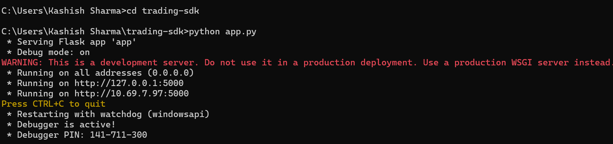
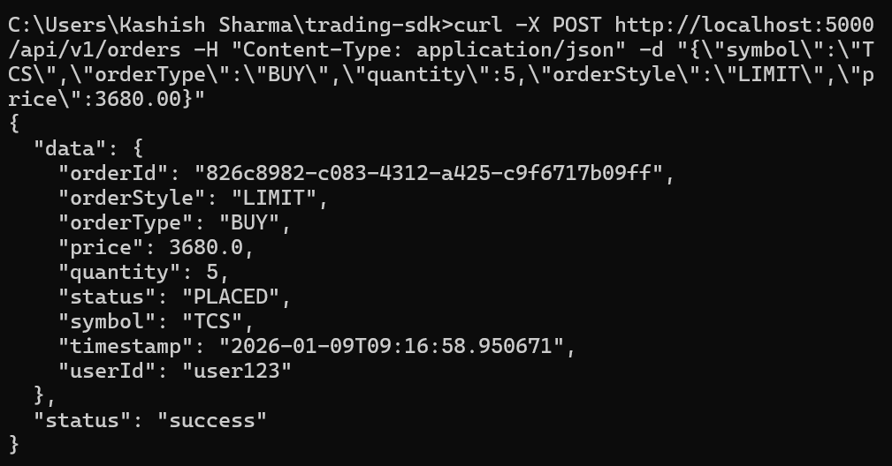
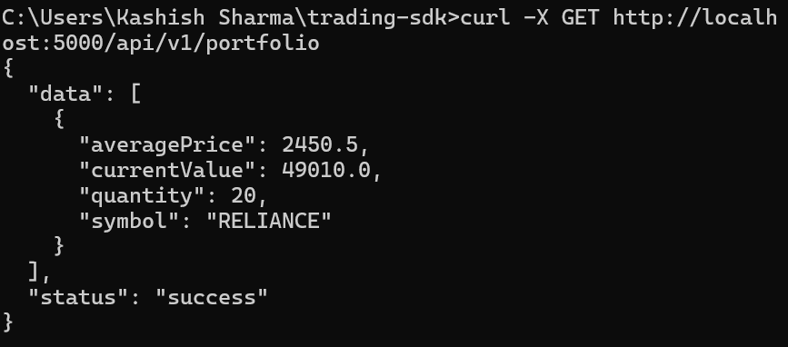
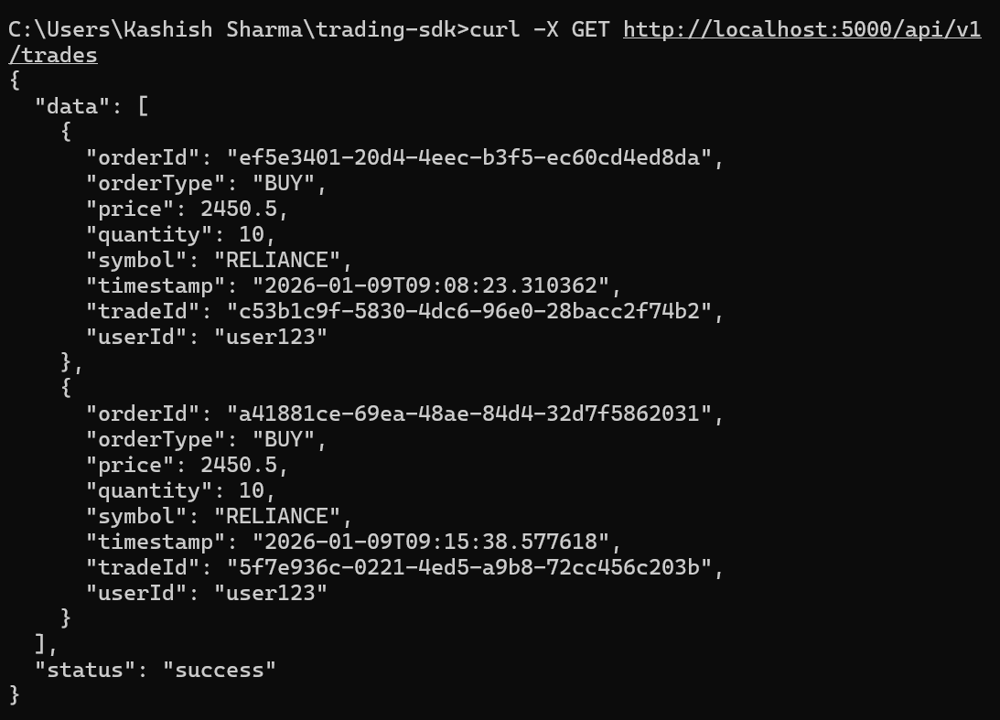
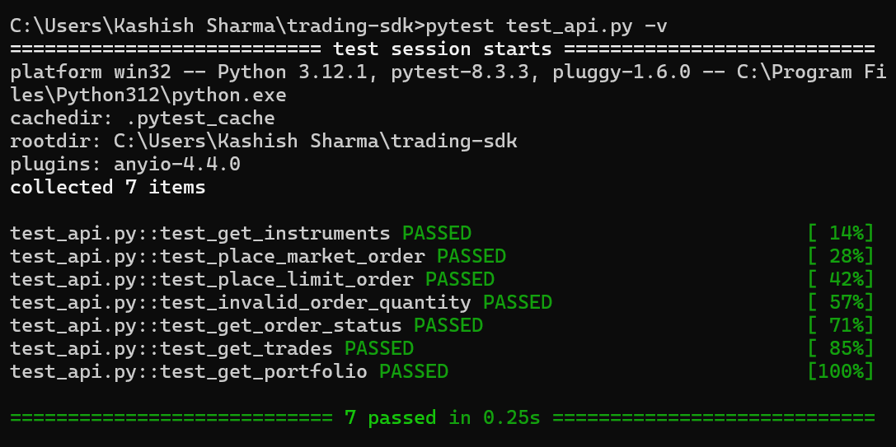
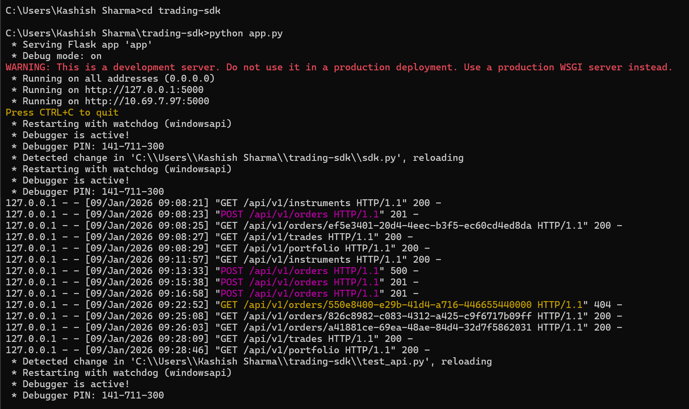

### Trading SDK 


A simplified trading platform backend with REST APIs and a Python SDK wrapper for managing orders, trades, and portfolio holdings.

---

## Table of Contents
- [Features]
- [Technology Stack]
- [Project Structure]
- [Setup Instructions]
- [API Documentation]
- [SDK Usage]
- [Testing]
- [Assumptions]

---

## Features

**Instrument Management** - Fetch tradable instruments  
**Order Placement** - Place BUY/SELL orders (MARKET/LIMIT)  
**Order Status** - Track order lifecycle (NEW → PLACED → EXECUTED)  
**Trade History** - View executed trades  
**Portfolio Tracking** - Monitor holdings and current value  
**Automatic Execution** - MARKET orders execute immediately  
**Input Validation** - Proper error handling with HTTP status codes  
**Unit Tests** - Test coverage for critical APIs  

---

## Technology Stack

- **Backend**: Python 3.8+
- **Framework**: Flask (REST API)
- **Storage**: In-memory data structures (dictionaries and lists)
- **Testing**: pytest
- **SDK**: Python requests library

---

## Project Structure

```
trading-sdk/
│
├── app.py              # Main Flask application with REST APIs
├── sdk.py              # Wrapper SDK client
├── test_api.py         # Unit tests
├── requirements.txt    # Python dependencies
└── README.md           # This file
```

---

## Setup Instructions

### Prerequisites
- Python 3.8 or higher
- pip (Python package manager)

### Step 1: Clone/Download the Project
```bash
cd trading-sdk
```

### Step 2: Install Dependencies
```bash
pip install -r requirements.txt
```

### Step 3: Run the Flask API Server
```bash
python app.py
```

The server will start at `http://localhost:5000`

You should see:
```
 * Running on http://0.0.0.0:5000
```



### Step 4: Test the SDK (in a new terminal)
```bash
python sdk.py
```

This will run example API calls and display results.


---

## API Documentation

### Base URL
```
http://localhost:5000/api/v1
```

### 1. Get Instruments
**Endpoint**: `GET /api/v1/instruments`

**Description**: Returns list of tradable stocks. Each stock has: symbol, exchange, type, price.

**Response**:
```json
{
  "status": "success",
  "data": [
    {
      "symbol": "RELIANCE",
      "exchange": "NSE",
      "instrumentType": "EQUITY",
      "lastTradedPrice": 2450.50
    }
  ]
}
```

**cURL Example**:
```bash
curl -X GET http://localhost:5000/api/v1/instruments
```

---

### 2. Place Order
**Endpoint**: `POST /api/v1/orders`

**Description**: Place a new buy/sell order

**Request Body**:
```json
{
  "symbol": "RELIANCE",
  "orderType": "BUY",
  "quantity": 10,
  "orderStyle": "MARKET"
}
```

**Parameters**:
- `symbol` (string, required): Trading symbol
- `orderType` (string, required): "BUY" or "SELL"
- `quantity` (integer, required): Must be > 0
- `orderStyle` (string, required): "MARKET" or "LIMIT"
- `price` (float, required for LIMIT orders): Order price

**Response**:
```json
{
  "status": "success",
  "data": {
    "orderId": "550e8400-e29b-41d4-a716-446655440000",
    "symbol": "RELIANCE",
    "orderType": "BUY",
    "quantity": 10,
    "price": 2450.50,
    "status": "EXECUTED",
    "timestamp": "2024-01-09T10:30:00"
  }
}
```

**cURL Example (MARKET Order)**:
```bash
curl -X POST http://localhost:5000/api/v1/orders -H "Content-Type: application/json" -d "{\"symbol\":\"RELIANCE\",\"orderType\":\"BUY\",\"quantity\":10,\"orderStyle\":\"MARKET\"}"
```

**cURL Example (LIMIT Order)**:
```bash
curl -X POST http://localhost:5000/api/v1/orders -H "Content-Type: application/json" -d "{\"symbol\":\"TCS\",\"orderType\":\"BUY\",\"quantity\":5,\"orderStyle\":\"LIMIT\",\"price\":3680.00}"
```


---

### 3. Get Order Status
**Endpoint**: `GET /api/v1/orders/{orderId}`

**Description**: Fetch status of a specific order

**Response**:
```json
{
  "status": "success",
  "data": {
    "orderId": "550e8400-e29b-41d4-a716-446655440000",
    "status": "EXECUTED",
    "symbol": "RELIANCE",
    "quantity": 10
  }
}
```

**cURL Example**:
```bash
curl -X GET http://localhost:5000/api/v1/orders/550e8400-e29b-41d4-a716-446655440000
```

**Order States**:
- `NEW` - Order created
- `PLACED` - Order submitted to exchange
- `EXECUTED` - Order completed
- `CANCELLED` - Order cancelled

---

### 4. Get Trades
**Endpoint**: `GET /api/v1/trades`

**Description**: Fetch all executed trades

**Response**:
```json
{
  "status": "success",
  "data": [
    {
      "tradeId": "123e4567-e89b-12d3-a456-426614174000",
      "orderId": "550e8400-e29b-41d4-a716-446655440000",
      "symbol": "RELIANCE",
      "orderType": "BUY",
      "quantity": 10,
      "price": 2450.50,
      "timestamp": "2024-01-09T10:30:00"
    }
  ]
}
```

**cURL Example**:
```bash
curl -X GET http://localhost:5000/api/v1/trades
```

---

### 5. Get Portfolio
**Endpoint**: `GET /api/v1/portfolio`

**Description**: Fetch current portfolio holdings

**Response**:
```json
{
  "status": "success",
  "data": [
    {
      "symbol": "RELIANCE",
      "quantity": 10,
      "averagePrice": 2450.50,
      "currentValue": 24505.00
    }
  ]
}
```

**cURL Example**:
```bash
curl -X GET http://localhost:5000/api/v1/portfolio
```

---

## SDK Usage

### Initialize SDK
```python
from sdk import TradingSDK

sdk = TradingSDK(base_url="http://localhost:5000")
```

### 1. Get Instruments
```python
instruments = sdk.get_instruments()
print(instruments)
```

### 2. Place Order
```python
# MARKET order
order = sdk.place_order(
    symbol="RELIANCE",
    order_type="BUY",
    quantity=10,
    order_style="MARKET"
)

# LIMIT order
order = sdk.place_order(
    symbol="TCS",
    order_type="BUY",
    quantity=5,
    order_style="LIMIT",
    price=3680.00
)
```

### 3. Check Order Status
```python
status = sdk.get_order_status(order_id="550e8400-e29b-41d4-a716-446655440000")
```

### 4. Get Trades
```python
trades = sdk.get_trades()
```


### 5. Get Portfolio
```python
portfolio = sdk.get_portfolio()
```

---

## Testing

### Run Unit Tests
```bash
pytest test_api.py -v
```

### Expected Output


---



## Assumptions

### 1. **Authentication**
- Single hardcoded user (`user123`)
- No authentication/authorization required
- Suitable for demonstration purposes only

### 2. **Data Storage**
- In-memory storage using Python dictionaries
- Data is lost when server restarts
- No database setup required

### 3. **Order Execution Logic**
- MARKET orders execute **immediately** at `lastTradedPrice`
- LIMIT orders remain in `PLACED` status (manual execution not implemented)
- No matching engine or order book

### 4. **Portfolio Management**
- Portfolio calculates average price automatically
- SELL orders validate against available holdings
- Current value uses latest traded price

### 5. **Instruments**
- Pre-loaded with 5 sample stocks (RELIANCE, TCS, INFY, HDFCBANK, ICICIBANK)
- Prices are static (don't update in real-time)

### 6. **Error Handling**
- Standard HTTP status codes (200, 201, 400, 404, 500)
- JSON error responses with descriptive messages

### 7. **Validations**
- Quantity must be > 0
- Price required for LIMIT orders
- Symbol must exist in instruments list
- Sufficient holdings check for SELL orders

---

## HTTP Status Codes

| Code | Meaning |
|------|---------|
| 200 | Success (GET requests) |
| 201 | Created (POST requests) |
| 400 | Bad Request (validation errors) |
| 404 | Not Found (invalid order ID) |
| 500 | Internal Server Error |

---

## Sample API Flow

### Complete Trading Workflow

1. **View available instruments**
```bash
curl http://localhost:5000/api/v1/instruments
```

2. **Place a BUY order**
```bash
curl -X POST http://localhost:5000/api/v1/orders -H "Content-Type: application/json" -d "{\"symbol\":\"RELIANCE\",\"orderType\":\"BUY\",\"quantity\":10,\"orderStyle\":\"MARKET\"}"
```

3. **Check order status** (use orderId from step 2)
```bash
curl http://localhost:5000/api/v1/orders/{orderId}
```

4. **View executed trades**
```bash
curl http://localhost:5000/api/v1/trades
```

5. **Check portfolio**
```bash
curl http://localhost:5000/api/v1/portfolio
```

---

## Future Enhancements (Not Implemented)

- Real database (PostgreSQL/MySQL)
- User authentication with JWT tokens
- WebSocket support for real-time updates
- Advanced order types (Stop-Loss, GTD)
- Order cancellation API
- Swagger/OpenAPI documentation
- Docker containerization

---


